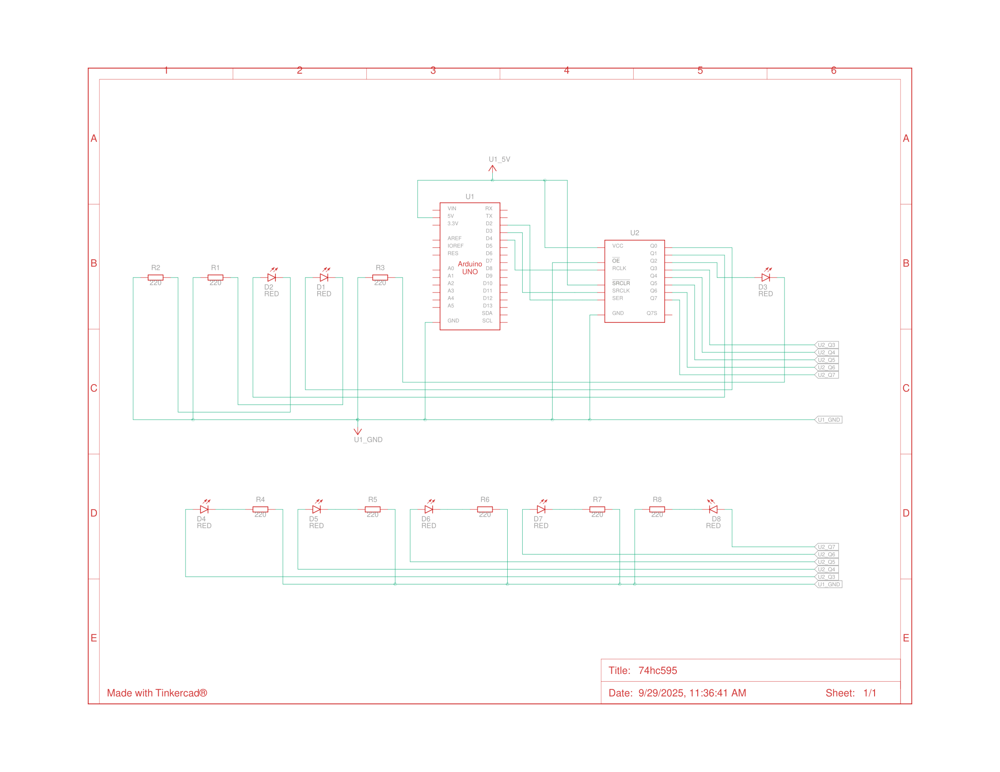

# 74HC595 Shift Register (with Arduino)

This project counts from 0 to 255 in binary using 8 LEDs controlled by a 74HC595 shift register.
Each LED represents one bit of the binary number, and the count increments every 200ms (or a configurable interval), demonstrating how a shift register can expand the output pins of an Arduino.

---

## ⚡ Features

- Counts from 0 to 255 in binary.  
- Displays the binary number using 8 LEDs.  
- Uses a 74HC595 shift register to expand Arduino output pins.  
- Demonstrates basic use of shift registers.

---

## 🛠️ Components Required

| Quantity | Component                  | Notes / Description           |
|----------|---------------------------|--------------------------------|
| 1x       | Arduino board             | e.g., Uno, Nano, Mega          |
| 1x       | 74HC595 IC                | Shift register                 |
| 8x       | LEDs                      | Any color                      |
| 8x       | Resistors                 | 200Ω                           |
| 1x       | Breadboard                | For component connections      |
| -        | Jumper wires              | For connections on breadboard  |

---

## 📂 Project Structure

```
74hc595-shift-register/
├── 74hc595.ino          # Main Arduino sketch
├── README.md            # Documentation for this project
└── assets/              # Images, schematics, diagrams
    └── wiring.png
```

---

## 🔧 How to Use

1. Open the `.ino` file in [Arduino IDE](https://www.arduino.cc/en/software) or [Arduino CLI](https://arduino.github.io/arduino-cli/latest/).
2. Select the correct **board** and **port**.
4. Connect the components as shown in the wiring diagram.
5. Upload the code to your Arduino.

---

## 📊 Circuit Diagram



---

## 📜 License
This project is licensed under the [MIT License](../../../LICENSE).  
